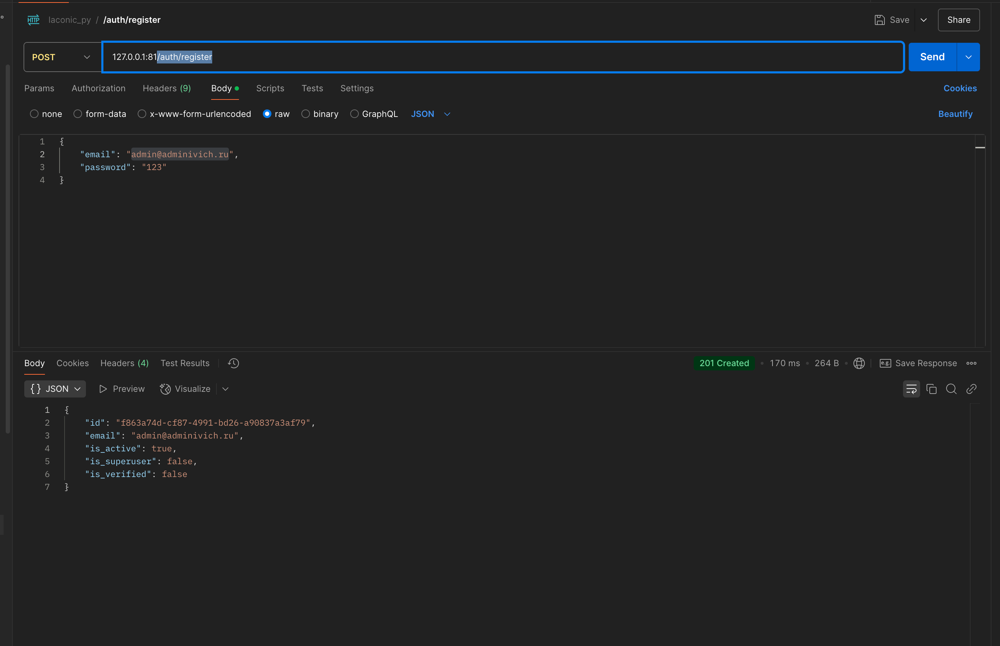
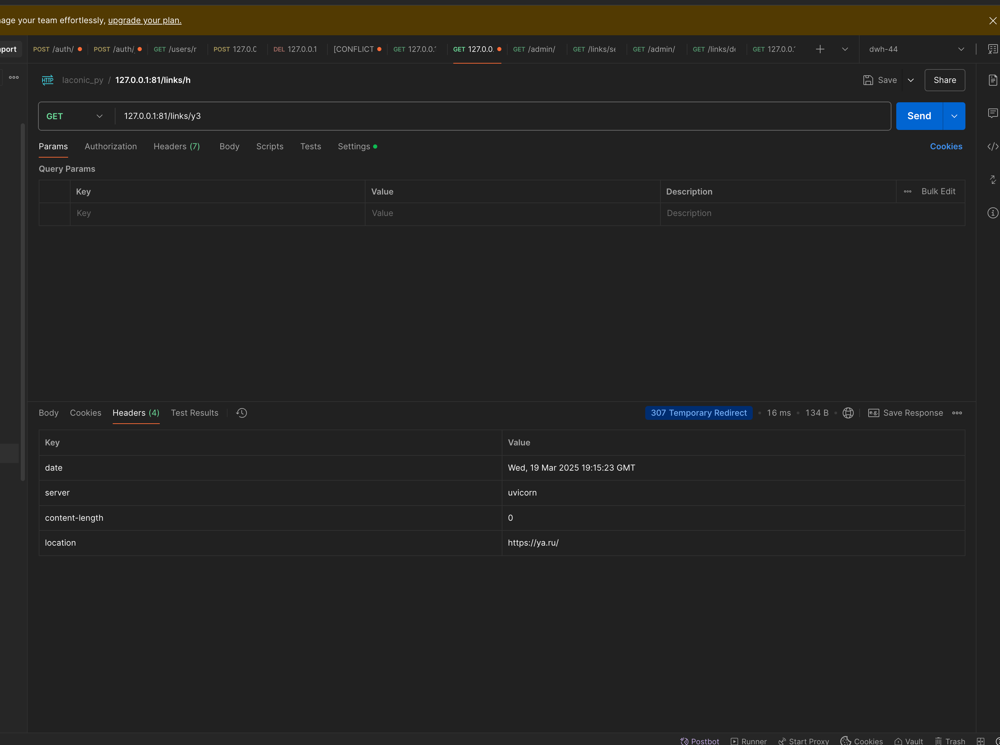

# Учебный сервис для сокращения ссылок

### Студент: Михаил Сахаров ИИ-24 (Base)

Согласно заданию создан сервис который сокращает переданную ссылку.

Реализовано два набора методов: для обычного пользователя и для администратора. И одна ссылка доуспная всем. 
- `GET /shorten/{short_link}` - делает редирект на оригинальную ссылку (307 код ответа + header Location)

Для пользователя (работают только с сылками пользователя)
- `POST /shorten` - сокращает ссылку
- `PUT /shorten` - вносит изменения в уже созданную сокращенную ссылку (expires_at, original_link)
- `DELETE /shorten/{short_link}` - удаляет сокращенную ссылку 
- `GET /shorten/{short_link}/stats` - возвращает статистику по сокращенным ссылкам (количество просмотров и время последнего перехода)

Для администратора (работают со всеми ссылками) - это дополнительные функции.

Решил в качестве доп функций реализовать набросок раздела админимстратора. 

- `GET /admin/links/expired` - возвращает все просроченные ссылки
- `GET /admin/links/search` - поиск по всем ссылкам (по оригинальной ссылке)
- `GET /admin/links/del_unauth_links` - удаление всех анонимных ссылок старше 30 дней (параметр задается в конфиге)

### Публичный репозиторий проекта

https://github.com/mcccccccccc/laconic-py

### Регистрация и авторизация

В проекте использована библиотека fastapi_users. Она из коробки позволяет добавить функции регистрации, авторизации, работы с токенами и пользователями. 

Эта библиотека добавила следующие роуты
- `/auth/jwt/login` - логин
- `/auth/jwt/logout` - логаут
- `/auth/jwt/refresh` - обновление токена
- `/auth/jwt/verify` - проверка токена
- `POST /auth/register` - регистрация

Про остальные технические роуты и про архитектуру пользователей можно прочитать в документации библиотеки: https://fastapi-users.github.io/fastapi-users/latest/

### Хранилище и кеш

В качестве хранилища использована база данных PostgreSQL. В ней хранится вся информация о ссылках и пользователях.

В базе созданы 2 таблицы:
- `short_links` - таблица со ссылками
- `user` - таблица с пользователями

Для кеширования ссылок используется Redis. Он хранит в себе сокращенные ссылки и снижает нагрузку на PostgreSQL.

### Миграции с помощью alembic.

В проект добавлен механизм миграции БД на основе alembic. Он позволяет создавать и откатывать миграции.

Создана первая миграция, которая добавляет колонку user_id в таблицу short_links. Она позволяет связывать ссылку с пользователем.

Создание таблиц с нуля реализовано средствами SQLAlchemy.

Команда запуска миграций выполняется из окружения контейнера:

`docker-compose exec app alembic upgrade head`

### Контейнер проекта и docker-compose

Поместил проект в докер. Dockerfile для fastapi приложения имеется. 

Docker-compose файл объединяет 4 контейнера:
- app - контейнер с fastapi приложением
- db - контейнер с PostgreSQL
- redis - контейнер с Redis
- adminer - контейнер с pgAdmin (минималистичный web ui для работы с PostgreSQL)

Хранилище данных для PostgreSQL и Redis вынесено в два volume. Они хранится на хосте и не удаляется при пересоздании контейнеров.

Порты, доступы к базе данных и к Redis передаются через переменны окружения в docker-compose файле. Можно легко перейти на environment variables/secrets в github.

Собрать контейнер приложения (только его надо собрать):

`docker-compose build app`

Запуск всего проекта

`docker-compose up -d`

### Развернул сервис на своей виртуалке

Swagger docs: https://ml.saharov.net:81/docs

Скриншоты того как делаю запросы на него из Postman:

### Коллекция Postman с запросами к сервису

[laconic_py.postman_collection.json](laconic_py.postman_collection.json)

